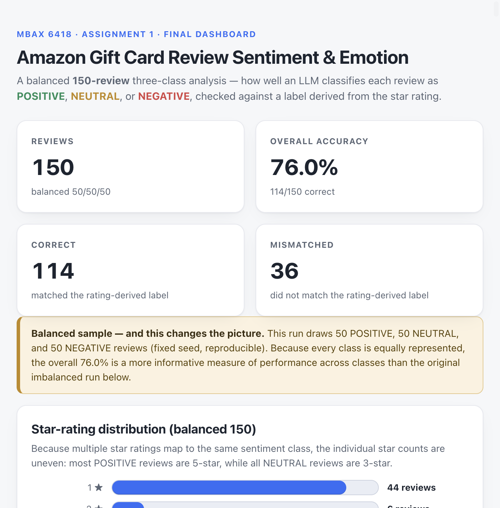
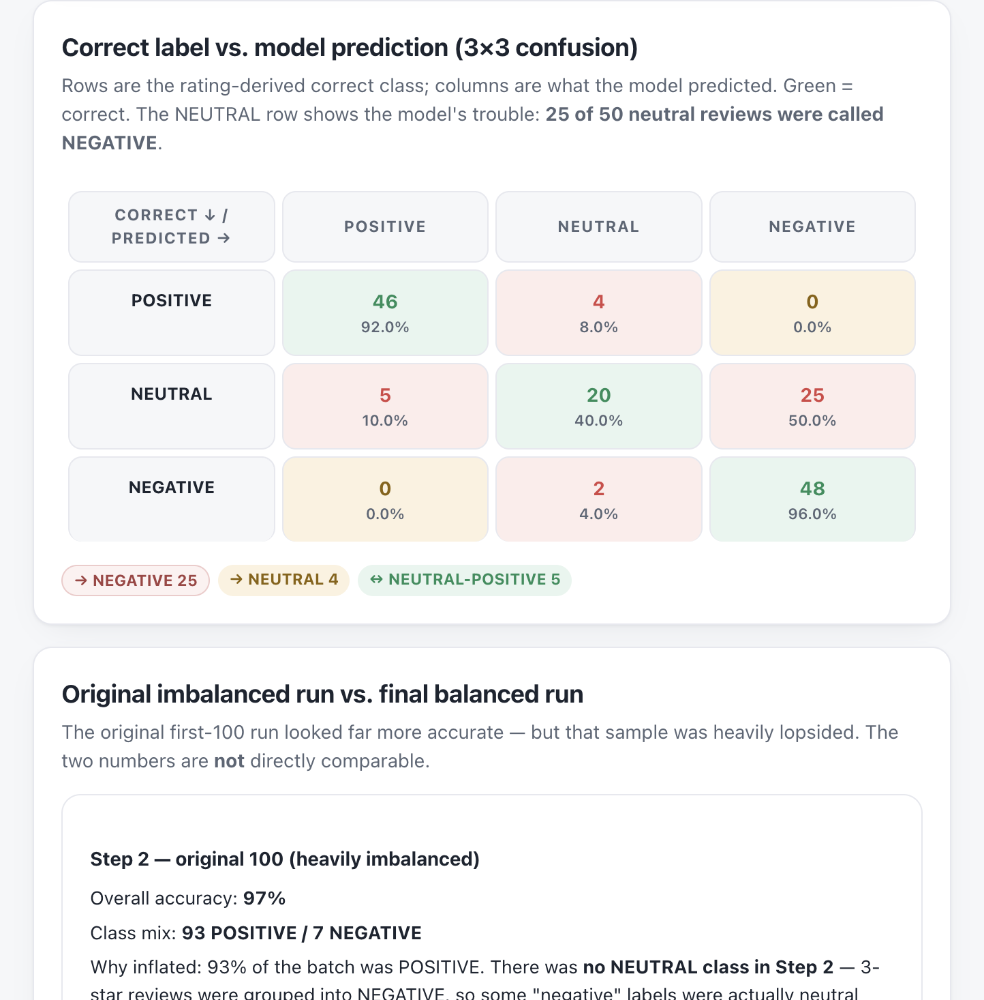

# MBAX 6418 — Assignment 1

**Sentiment & Emotion Classification of Amazon Reviews**

## Project overview

For this project, I built a sentiment and emotion classifier for Amazon product
reviews. An LLM reads each review's title and body text and predicts a sentiment
(POSITIVE / NEUTRAL / NEGATIVE) plus a primary emotion (one of eight NRC emotion
labels). Its predictions are judged against a "correct" label derived from the
review's own star rating — the rating is used only for evaluation and is never
shown to the model. Results are presented in a single self-contained HTML
dashboard.

## Data

I used the **Amazon 2023 "Gift Cards" review category** from the Amazon Reviews
'23 dataset, collected by the **McAuley Lab at UC San Diego**:

- Dataset page: https://amazon-reviews-2023.github.io
- Gift Cards review file:
  https://mcauleylab.ucsd.edu/public_datasets/data/amazon_2023/raw/review_categories/Gift_Cards.jsonl.gz

It is a gzipped JSON-lines file; each line is one review. I used the fields
`rating`, `title`, `text`, `verified_purchase`, `helpful_vote`, `timestamp`, and
`asin`. The raw file is large and re-downloadable, so it is kept out of the
repository (see `.gitignore`).

## Method

- **Model input:** the review **title** and **text** only. The star **rating is
  never sent to the model**.
- **Rating-derived correct label** (computed only after prediction):
  - 4–5 stars = POSITIVE
  - 3 stars = NEUTRAL
  - 1–2 stars = NEGATIVE
- The model is called through an OpenAI-compatible endpoint
  (`cyankiwi/Qwen3.6-35B-A3B-AWQ-4bit`) with reasoning disabled and, for the
  final three-class run, an enforced JSON-schema response format so the emotion
  stays within the eight allowed labels.
- **Balanced sample:** 50 reviews per class (50 POSITIVE / 50 NEUTRAL /
  50 NEGATIVE, 150 total) drawn from the whole file with a **fixed random seed
  (6418)**, so the exact same sample can be reproduced.
- **Emotions:** the LLM predicts one of eight NRC emotion labels (anger,
  anticipation, disgust, fear, joy, sadness, surprise, trust). An independent
  method scores each review's words against the **NRC Emotion Lexicon**
  (Mohammad, NRC-Emotion-Lexicon-Wordlevel-v0.92,
  https://saifmohammad.com/WebPages/NRC-Emotion-Lexicon.htm) and takes the
  highest-scoring emotion; ties are broken by a fixed priority order and a "no
  emotion found" result is labeled NONE.

## Results — final balanced three-class run

- 150 reviews: **50 POSITIVE / 50 NEUTRAL / 50 NEGATIVE**
- **Overall accuracy: 114/150 = 76.0%**
- POSITIVE: **46/50 = 92.0%**
- NEUTRAL: **20/50 = 40.0%**
- NEGATIVE: **48/50 = 96.0%**

Confusion matrix (rows = rating-derived correct class, columns = model prediction):

| Correct \ Predicted | POSITIVE | NEUTRAL | NEGATIVE |
|---|---|---|---|
| POSITIVE | 46 | 4 | 0 |
| NEUTRAL | 5 | 20 | 25 |
| NEGATIVE | 0 | 2 | 48 |

### 1. Why did the lopsided run look very accurate, and what changed after balancing?

The original first-100 run (Step 2) scored **97.0%**, but the batch was
heavily imbalanced at **93 POSITIVE / 7 NEGATIVE**, and it had **no
separate NEUTRAL class** — 3-star reviews were grouped into NEGATIVE. A model
that mostly predicted POSITIVE looked very accurate because that was nearly every
review.

The balanced run uses 50 reviews from each class, which makes it easier to see
how the model performs across POSITIVE, NEUTRAL, and NEGATIVE reviews. Accuracy
dropped to **76.0%**, mainly because the model struggled with the newly
separated NEUTRAL class. The two runs are not directly comparable because the
class definitions and sample composition changed.

### 2. Where do the model's mistakes go?

The dominant mistake is on 3-star NEUTRAL reviews:

- **25 of 50 rating-derived NEUTRAL were predicted
  NEGATIVE** (25/50 = 50.0%)
- **5 of 50 NEUTRAL were predicted POSITIVE**
  (10.0%)
- only **20 of 50 NEUTRAL were correctly identified**
- **4 POSITIVE** were predicted NEUTRAL
- **2 NEGATIVE** were predicted NEUTRAL
- there was **no direct POSITIVE↔NEGATIVE confusion** in the final matrix

So the model tended to classify many 3-star (neutral) reviews as **NEGATIVE**
rather than NEUTRAL (and a small number as POSITIVE). This was the model's
biggest weakness in the balanced run and became clear once 3-star reviews were
treated as their own NEUTRAL class.

### 3. How do the LLM and NRC emotion methods differ, and why?

This emotion comparison is a **separate analysis on the original 100-review
sample (Step 5)** — not the balanced 150. It compares the LLM's primary emotion
against an independent NRC word-list emotion:

- Two methods agreed on **22/100 = 22.0%** of reviews
- Excluding the 15 reviews where NRC found no emotion: **22/85 =
  25.9%**
- The dominant disagreement was **LLM joy → NRC anticipation** (51 cases)
- 52 of the 85 nonzero-NRC reviews had a tied top score; 48 of those
  ties were resolved to anticipation by the fixed priority rule
- Of the 51 joy→anticipation disagreements, 43 involved
  anticipation merely *tying* joy, while only 8 had anticipation
  clearly outscore joy

The two methods disagree for a couple of reasons. The LLM considers the full
context of the review, while the NRC method simply counts words associated with
each emotion. The tie-break rule also affected the NRC results quite a bit.
Because anticipation often tied with joy and had higher priority, many reviews
ended up labeled anticipation even when it did not clearly score higher.

## Issues / debugging

Issues were recorded continuously in `notes/issues.md`. The most meaningful
ones:

- **Empty model output (Step 1).** The reasoning model consumed its token budget
  on hidden thinking and returned empty `content`. Fixed by disabling thinking
  (`enable_thinking=false`) so a bare token is returned.
- **Invisible dashboard bars.** Colored bar fills were ``s, which ignore
  `width`/`height` in Chrome. Fixed with block layout.
- **Donut semantics.** The chart's center showed a metric different from the
  slice it plotted. Corrected so the chart tells one consistent story.
- **Emotion labels escaped the eight-label set (Step 6).** On a few reviews the
  model returned words like "disappointment"/"frustration". Prompt rewording
  alone was not enough, so I switched to an **enforced JSON-schema
  `response_format`** (constrained decoding) so the emotion stays in the eight
  labels.
- **Percentages displayed 100× too large.** A percentage was multiplied by 100
  a second time; fixed and verified in the browser.

I documented each issue in `notes/issues.md` and updated the code as problems
came up.

## Dashboard

The results are presented in `dashboard.html`, a single self-contained HTML file
(no server, works offline). It shows the headline metrics, a star-rating
distribution, a 3×3 confusion matrix, accuracy by class, the NEUTRAL-breakdown,
an imbalanced-vs-balanced comparison, an interactive review table with
All/Correct/Mismatched, class and keyword filters and a live count, and a
clearly-separated emotion section.

Screenshots:

## How to reproduce

Pipeline scripts live in `scripts/`:

- `scripts/step6_select_sample.py` — select the balanced 150-review sample
  (seed 6418) and save `outputs/step6_sample.json`
- `scripts/score_step6.py` — run the balanced 150 through the model and save
  `outputs/step6_results.json` (three-class sentiment + emotion)
- `scripts/score_nrc.py` — derive primary emotion from the NRC word list
  (`outputs/step5_nrc_raw.json` on the original 100)
- `scripts/score_emotion_llm.py` — LLM emotion on the original 100
  (`outputs/step5_llm_raw.json`)
- `scripts/build_dashboard.py` — read the saved outputs and produce
  `dashboard.html`
- `scripts/build_readme.py` — generate this README from the saved outputs

Saved outputs are in `outputs/`. The reusable prompt is
`prompts/sentiment_threeclass_prompt.txt`.

To use the code you would provide your own endpoint settings in a local `.env`
(not committed). The Amazon dataset is downloaded separately and kept out of the
repository.

- The **NRC Emotion Lexicon** file `NRC-Emotion-Lexicon-Wordlevel-v0.92.txt`
  should be downloaded and placed at
  `data/nrc/NRC-Emotion-Lexicon-Wordlevel-v0.92.txt`.
- The project uses only the **Python 3 standard library**, so no third-party
  `pip` packages are required.
